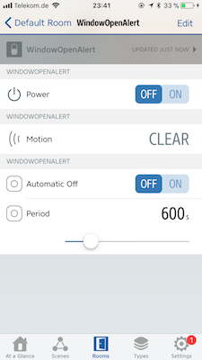

# Automation Switch

HomeKit (as of iOS 11.1) does not provide a capability to delay the execution of rules. This plugin provides an automation switch that can be used to build a set of rules that are delayed in execution by a configurable period of time on each switch. The period as well as the repetetiveness and the response can be configured via HomeKit (while the configuration provides sane defaults) and can also be changed in response to rules.

This switch optionally supports being saved to storage on every state change, the switch will save the settings and restore them when homebridge is restarted.

> Please note that while the plugin works with the Home app, some features, such as dynamic
> reconfiguration can only be used with other HomeKit apps, such as [Elgato Eve](https://www.elgato.com/en/eve/eve-app).

## Appearance

Each automation switch provides a regular switch, a motion sensor and a configuration service. Activating the switch starts a timer, which will trigger the motion sensor for 1s when the timer elapses. This can be used as a trigger for HomeKit rules.

The switch support two modes: An automatic shut off mode, where the motion sensor will only be tripped once and the switch is automatically shut off. The other mode is a repeating mode, where the motion sensor will be tripped repeatedly until the switch is shut off again.



(Screenshot: Elgato Eve)

## Configuration

```json
{
  "bridge": {
      ...
  },
  "platforms": [
    {
      "platform": "AutomationSwitches",
      "switches": [
        {
          "type": "automation",
          "name": "Automation Switch #1",
          "period": 1800,
          "autoOff": false
        }
      ]
    }
  ]
}
```

## Options

| Attributes | Required | Usage |
|------------|----------|-------|
| type | Yes | Set this to ```automation``` to make this entry an automation switch. |
| name | Yes | A unique name for the automation switch. Will be used as the accessory name. |
| period | Yes | The default time delay of the switch in seconds, before the sensor is triggered. |
| autoOff | Yes | Set this to ```true``` to automatically turn the switch off after the period has expired once, ```false``` to keep the triggering the sensor until it has expired. |
| default | No | Specifies the default state of the switch. This is used if the switch is not yet stored, not stored or the storage has become faulty. The default state is ```false``` if not specified, which means the switch is off. Setting this to ```true``` turns the switch on by default. |
| stored | No | Set this to true if you want the switch to retain its on/off state across restarts. The default setting for the ```switch``` type is  ```false```. |

See [configuration](Configuration.md) for more advanced configuration examples.

## Usage

This type of switch is best used if you need to delay the execution of a scene or if you need to execute the scene multiple times until something else has happened.

I personally have used this to send me notifications until I close the bathroom window, reminding me every 10 minutes that the window is open and I might freeze to the toilet seat. For that I combine this switch type with my [homebridge-telegram](https://www.npmjs.com/packages/homebridge-telegram) plugin. (Shameless plug.)

## Notes

### Stored switch states

This switch has logic, which is tied to the state of the switch (e.g. 'On' or 'Off'.) The initial state of the switch is determined either by the "default" field in the configuration or by the value saved just before homebridge terminated the last time.

If the initial value is `true` the timer controlled by the switch will immediately start as soon as the plugin is initialized. This can also serve to delay initialization just after homebridge has been loaded.

### Editing the timeout period

If the automation switch was stored the default period from the configuration file is also not used any longer. To edit the timeout in those cases, either edit the file that belongs to the switch (located in your homebridge configuration directory under the persist folder) or delete it and then edit the default again.
