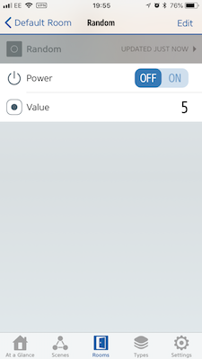
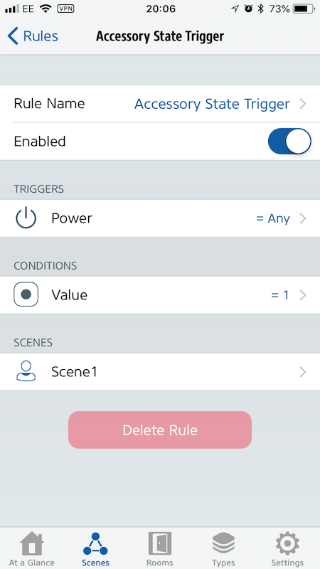

# Random  
  
This provides a basic on/off style switch that will select a random number between 1 and the configured maximum value. It is design to help you select a random property by using automation (for example, select a random scene every time the switch is turned on).
  
## Appearance  
  
You will get a switch and a `Value` property.
  
  
  
(Screenshot: Elgato Eve)  
  
## Configuration  
  
```json  
{
   "platforms": [
      {
         "platform":"AutomationSwitches",
         "switches": [
            {
               "type": "random",
               "name": "Random",
               "max": 15
            }
         ]
      }
   ]
}
```  
  
## Options  
  
| Field | Required | Description |  
|---|---|---|  
| type | Yes | Set this to ```random``` to make this entry a random selector. |  
| name | Yes | Set this to the name of the switch as you want it to appear in HomeKit apps. |  
| max | Yes | The maximum number to be selected randomly |  

## Usage  
  
This switch is really useful to trigger random scene. Create an automation that watches for changes in the switch state. When the state changes (e.g. turned on/off), use the `Value` field as **condition** for your automation. Turn on the switch and the automation matching the `Value` will activate.

  