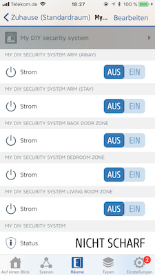

# Security System

The security system switches enable an easier creation of home alarm systems using already available accessories. Security system switches have default HomeKit notifications associated with them.

## Appearance

The security system provides labelled buttons for the various armed/unarmed states as well
as a button to trigger an alarm.



(Screenshot: Elgato Eve)

## Configuration

```json
{
  "bridge": {
      ...
  },
  "platforms": [
    {
      "platform": "AutomationSwitches",
      "switches": [
        {
          "type": "security",
          "name": "My DIY security system",
          "default": "unarmed",
          "stored": false
        }
      ]
    }
  ]
}
```

## Options

| Field | Required | Description |
|---|---|---|
| type | Yes | Set this to ```security``` to make this entry a security system. |
| name | Yes | Set this to the name of the security system as you want it to appear in HomeKit apps. |
| default | No | This configures the default state of the security system if it is not yet stored, never stored or the storage has become faulty. Set this to ```unarmed```, or ```armed-away```, ```armed-stay``` or ```armed-night``` depending on your needs. By default a security system is ```unarmed``` if this is not specified. |
| stored | No | The state of security systems are by default stored. Set this to ```false``` if you do not want the security system to retain its armed/unarmed and alarm state across restarts. |

See [configuration](Configuration.md) for more advanced configuration examples.

## Usage

This is best used if you want to build your own home security system. Another use of this is to set up rules and conditions for smoke, leak or gas detectors and have different responses on the state of your home.

An additional use I have for this switch is to integrate with heating solutions and have centralized control over lighting, heating and security based on the mode of your home.

## HomeKit Notifications

HomeKit, by default, enables notifications for security system mechanisms. Once enabled you automatically get built-in notifications for this security system switch too. You can disable these notifications in the Home.app if you do not care for the notifications. To disable/enable the notifications, open the Home app, select the tile that represents the lock and long-press on it, choose Details and scroll down until you get to Notifications. You can disable them there.

There's unfortunately no way to change the notification text in HomeKit. If you're looking for something to send customized notifications I'd recommend one of the [IFTT plugins](https://www.npmjs.com/search?q=homebridge+ifttt) or my [homebridge-telegram](https://www.npmjs.com/packages/homebridge-telegram) plugin (shameless plug.)

## Typical rules for the security system

The following is an example rule for the security system, showing the versatility:

```text
When motion detected
And Security System State is Night Arm
Then Set Alarm to ON
And Turn on all lights
```

In essence you can create rules for each of the security system states and respond differently if the alarm happens during the night, when you're at home or away by building appropriate rules for it.