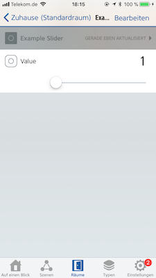

# Switch

This provides a basic slider without any of the features provided by other switches. It is designed to be this simple on purpose.

## Appearance

A slider can accept a value between a minimum and a maximum bound. The default value, minimum and maximum bounds are configurable.



(Screenshot: Elgato Eve)

## Configuration

```json
{
  "bridge": {
      ...
  },
  "platforms": [
    {
      "platform": "AutomationSwitches",
      "switches": [
        {
          "type": "slider",
          "name": "My basic slider",
          "stored": true,
          "default": 5,
          "minValue": 1,
          "maxValue": 10
        }
      ]
    }
  ]
}
```

## Options

| Field | Required | Description |
|---|---|---|
| type | Yes | Set this to ```slider``` to make this entry a slider. |
| name | Yes | Set this to the name of the slider as you want it to appear in HomeKit apps. |
| default | No | Specifies the default value of the slider. This is used if the slider is not yet stored, not stored or the storage has become faulty. The default value is ```0``` if not specified. |
| stored | No | Set this to true if you want the slider to retain its value across restarts. The default setting for the ```slider``` type is  ```false```. |
| minValue | Yes | Sets the minimum boundary of the slider. |
| maxValue | Yes | Sets the maximum boundary of the slider. |
| minStep | No | The minimum step between values of the slider. The default is 1. |

See [configuration](Configuration.md) for more advanced configuration examples.

## Restrictions

The slider is not useable in the official Apple Home app as it makes use of a custom service and characteristic.

## Examples

### Slider with steps

```json
{
  "bridge": {
      ...
  },
  "platforms": [
    {
      "platform": "AutomationSwitches",
      "switches": [
        {
          "type": "slider",
          "name": "My basic slider",
          "stored": true,
          "default": 5,
          "minValue": 0,
          "maxValue": 10,
          "minStep": 2
        }
      ]
    }
  ]
}
```


