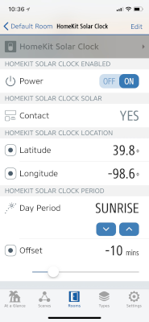

# Solar clock

This provides a programmable timer for HomeKit,
based on the solar period of a location. 
It is based on the [Alarm Clock](AlarmClock.md) timer.

## Appearance

The alarm clock provides an on/off toggle switch, and a contact sensor to indicate the alarm
Future versions may include a offset (e.g., for "10 minutes before Sunrise").



(Screenshot: Elgato Eve)

## Configuration

```json
{
  "bridge": {
      ...
  },
  "platforms": [
    {
      "platform": "AutomationSwitches",
      "switches": [
        {
          "type": "solarclock",
          "name": "HomeKit Solar Clock",
          "location": { "latitude": 39.833333, "longitude": -98.585522 },
          "period": "sunrise",
          "enabled": true
        }
      ]
    }
  ]
}
```

The above example creates an alarm clock, which by default closes the contact sensor every day at sunrise for the geographic
center of the United States.

## Options

| Field | Required | Description |
|---|---|---|
| type | Yes | Set this to ```solarclock``` to make this entry an alarm clock. |
| name | Yes | Set this to the name of the alarm clock as you want it to appear in HomeKit apps. |
| stored | No | Set this to true if you want the switch to retain its settings across restarts. The default is  ```false```. |
| location | Yes |Set this to the location for making solar calculations. |
| period | Yes | Set this to the solar period to trigger the alarm. One of:```"night"```, ```"morning twilight"```, ```"sunrise"```, ```"daytime"```, ```"sunset"```, or ```"evening twilight"```. |
| offset | No | Set this to the offset in minutes from the start of the period. The default is ```0```. **Not yet implemented.** |
| enabled | Yes | The default enabled state of the alarm. |

The defaults are only used if the stored state is unavailable.

## Beware of clocks, timezones and drift

The solar clock depends on proper geographic configuration for the desired solar period.

In addition,
the same time-related considerations for the [Alarm Clock](AlarmClock.md) timer apply.

## Usage

The contact sensor of the above solar clock is closed every day at sunrise. Attach a HomeKit rule to the contact sensor to
execute any actions as you wish and apply conditions to the rule if needed.
