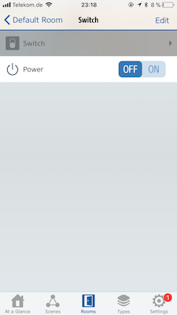

# Switch

This provides a basic on/off style switch without any of the features provided by other switches. It is designed to be this simple on purpose. If you're looking for advanced features you should take a look at
the [automation switch](AutomationSwitch.md).

## Appearance

A switch is a switch, what did you expect?



(Screenshot: Elgato Eve)

## Configuration

```json
{
  "bridge": {
      ...
  },
  "platforms": [
    {
      "platform": "AutomationSwitches",
      "switches": [
        {
          "type": "switch",
          "name": "My basic switch",
          "stored": true,
          "default": false
        }
      ]
    }
  ]
}
```

## Options

| Field | Required | Description |
|---|---|---|
| type | Yes | Set this to ```switch``` to make this entry a basic switch. |
| name | Yes | Set this to the name of the switch as you want it to appear in HomeKit apps. |
| default | No | Specifies the default state of the switch. This is used if the switch is not yet stored, not stored or the storage has become faulty. The default state is ```false``` if not specified, which means the switch is off. Setting this to ```true``` turns the switch on by default. |
| stored | No | Set this to true if you want the switch to retain its on/off state across restarts. The default setting for the ```switch``` type is  ```false```. |

See [configuration](Configuration.md) for more advanced configuration examples.

## Usage

This switch can be used like any real power switch. You can set rules based on the state of the switch and notifications will be sent for each change of the switch state.
